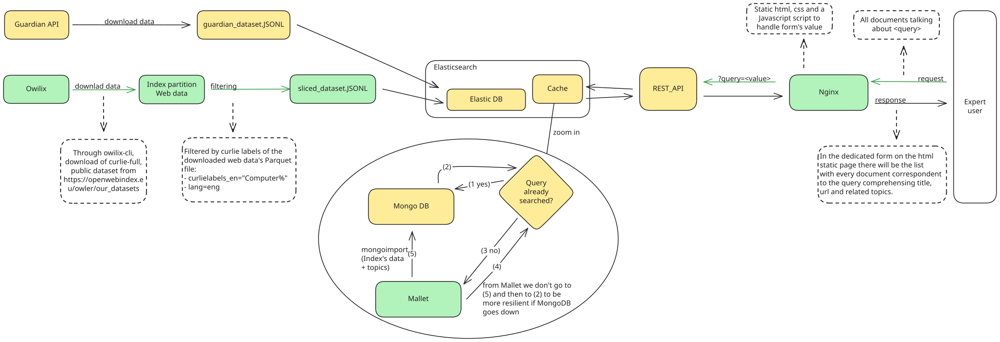

# Project of software platform's course 
The project's objective is to build a platform for obtaining documents from one or more online sources, identify the subset of these documents about science and technology, storing it, making it searchable, and extracting useful representations for expert users.

## Notes
### About the project
- **Storing it**: mongoDB or others;
- **Searchable**: mosaic, mongoDB, elasticsearch. I can use REST or other things that we will see in the next lessons.
- **Topic modeling**: from a given set of documents I have to understand the main topic of each document. **Suggestion**: LDA topic modeling

### About the requirements
- Use different services;
- (suggested) Use Docker for container deployment;
- The services must be implemented (mainly) in Java;
- **Document adpoted patterns**: if I need an adapter I develop it and then I have to document it. **Very important part of the project: patterns and architecture.**

### About the evaluation criteria
- Documentation
- Code
- Reproducibility
- Presentation: professor suggested to prepare a Power Point where **every** member of the group has to speak and partecipate.


# Project's structure
VERDE= (ipoteticamente) finito e funzionante, GIALLO = funzionante ma da integrare <br />


# **Components**

# OWI
The following command provide a sequencial way to download a dataset using owilix-cli from the owi database and to export the database as a JsonL file.

**A specific dataset denoted with internalID=XX has to be choosen, here in the example (and for the project too) we chose a dataset that is both "curlie_full" and "public".**

### Usage

- **Start container with attached shell** <br />
    `docker compose run --rm -it owilix bash`
    
- **Pull the raw dataset <br />**
    `owilix --yes remote pull all/internalID=fc4f5c20-ca02-11f0-a6f8-f6a03915313d num_threads=10 files="**/language=eng/*"` 

- **Manual importing dataset <br />**
    'owilix local insert file:///data/mydataset access=public collectionName="main" move=False'


- **Make a query selecting "curlielabels_en IS NOT NULL"**<br />
    `owilix query less --local all/internalID=fc4f5c20-ca02-11f0-a6f8-f6a03915313d "select=url,curlielabels_en,curlielabels" "where=curlielabels is not NULL"`<br />

- **Make a query selecting topic-related curlielabels (in this case "Computers..."):**<br />
     `owilix query less --local all/internalID=fc4f5c20-ca02-11f0-a6f8-f6a03915313d "select=url,curlielabels_en, curlielabels" "where=length(list_filter(curlielabels_en, x -> x LIKE 'Computers%')) > 0"`<br />


### Slicing and export of the selected documents based on their curlielabels
- **Slicing of the selected owilix's dataset(s). We want to have only the pages with curlielabels_en=Computers... (after Computers there can be everything)** <br />
    `owilix query slice --local all/internalID=fc4f5c20-ca02-11f0-a6f8-f6a03915313d "where=length(list_filter(curlielabels_en, x -> x LIKE 'Computers%')) > 0" collection_name=provaSlicing`

- **OWILIX export like a JSONL file** <br />
    `owilix query less --local all/internalID=f79bf6c8-52fe-11f0-a4a5-528c047b29ff as_json=True json_file=$PWD/all_data/json_out.json`<br />


    
# docker-compose.yml
**Since we have custom images** we don't want to do the default `docker compose up`. <br />
After we cloned the repository to a seamingless installation of the application we have to do
```
cd ~/.../softplat-project-main
./script/compileProject.sh
cd ..
docker compose up --build 
```
<br />

- **To start a container with attached shell** <br />
    `docker compose run --rm -it owilix bash`

# Mallet
Ready to use right from the first start-up. It is binded to one of the same volumes of owilix's container (./all_data:/all_data) so the sliced dataset is ready to be topic-modelled (????? corretto). <br /> 
- **To create an interactive shell that is auto-destroyed at the exit from the container**: <br /> 
    `docker compose run --rm -it mallet bash`


# MongoDB
Ready to use from the first start-up, the container has already installed the main tools to work on mongoDB such as mongosh and mongoimport. It is mapped at the port 27017. It remains up and running once the command ‘docker compose up’ has been executed.


# Nginx
The static HTML site is mapped at the port 4321 to avoid conflicts with other services mapped at the default port (80) on the host machine. To view it, simply connect to the URL `http://localhost:4321/`. It remains up and running once the command ‘docker compose up’ has been executed.


